# Frontend Model Architecture and Loading Notes

This document is based on the current repository sources, configs, scripts, and README. In this repo, the “frontend model” is the realtime **front-brain / Cerebellum** built on MiniCPM-o 4.5: the streaming **Thinker** plus optional **Talker** speech generator. The browser client is included only where it helps explain how the model collaborates with the backend runtime.

## Relevant modules

| Path | Role |
| --- | --- |
| [`gander_runtime/gander_runtime/online_duplex.py`](gander_runtime/gander_runtime/online_duplex.py#L608-L1539) | FastAPI/WebSocket serving layer for realtime duplex sessions, ASR proxying, screen upload, and session control. |
| [`gander_runtime/gander_runtime/task_tools_online.py`](gander_runtime/gander_runtime/task_tools_online.py#L53-L152) | Binds model-emitted task tools to one Gateway-backed realtime session. |
| [`gander_runtime/gander_runtime/lean_realtime.py`](gander_runtime/gander_runtime/lean_realtime.py#L24-L166) | Validates `task_start`, `task_send`, and `task_resolve` calls and formats backend responses. |
| [`gander_runtime/gander_runtime/duplex_bridge.py`](gander_runtime/gander_runtime/duplex_bridge.py#L10-L138) | Thread-safe bridge around one live duplex model session, including runtime-event injection. |
| [`minicpm_ft/mcpmft/infer/common.py`](minicpm_ft/mcpmft/infer/common.py#L22-L89) | Unified inference loader that composes checkpoints on top of the base MiniCPM-o model. |
| [`minicpm_ft/mcpmft/modeling/load.py`](minicpm_ft/mcpmft/modeling/load.py#L53-L188) | Base/composed loading, selected-prefix warm start, Talker overlay, and tokenizer extension. |
| [`minicpm_ft/mcpmft/modeling/freeze.py`](minicpm_ft/mcpmft/modeling/freeze.py#L9-L80) | Defines named module groups and which parameters are trainable. |
| [`minicpm_ft/mcpmft/modeling/omni_forward.py`](minicpm_ft/mcpmft/modeling/omni_forward.py#L21-L150) | Training wrapper and combined text/audio loss computation. |
| [`minicpm_ft/mcpmft/train/main.py`](minicpm_ft/mcpmft/train/main.py#L997-L1124) | Training assembly: load model, optionally warm-start prefixes, freeze modules, build collator, and run Trainer. |
| [`minicpm_ft/mcpmft/train/trainer.py`](minicpm_ft/mcpmft/train/trainer.py#L170-L231) | Save/resume behavior for trainable-only checkpoints. |
| [`minicpm_ft/mcpmft/data/sample.py`](minicpm_ft/mcpmft/data/sample.py#L57-L112) | JSONL row schema (`OmniSample`, `Turn`, `tools`, `meta`). |
| [`minicpm_ft/mcpmft/data/collator.py`](minicpm_ft/mcpmft/data/collator.py#L516-L817) | Frontbrain serialization, tool-context augmentation, sliding-context setup, and S3-code attachment. |
| [`minicpm_ft/mcpmft/data/serialize_duplex.py`](minicpm_ft/mcpmft/data/serialize_duplex.py#L1-L19) | Causal one-second unit layout used for duplex training. |
| [`minicpm_ft/mcpmft/tool_protocol.py`](minicpm_ft/mcpmft/tool_protocol.py#L49-L128) | Canonical task-tool schemas and `<tool_call>/<tool_response>` protocol. |

## 1. Frontend model ↔ backend collaboration

### Runtime components

At serve time, `gander_runtime.cli.build_app()` loads the Thinker checkpoint with `load_for_infer()`, optionally creates a detached Talker on another GPU, builds a `GanderGateway`, and exposes the realtime app returned by `create_online_duplex_app()`.[^build-app]

The realtime app exposes:

- `GET /health`
- `GET /api/asr/health`
- `POST /api/asr/transcribe`
- `WS /ws/duplex`
- `WS /ws/screen`[^online-routes]

### Session startup and transport

When a client opens `WS /ws/duplex`, the server allocates one active model session, constructs a `TaskToolsRealtimeCoordinator`, and sends a `ready` message containing the audio protocol, chunk size, tool/task protocol names, context settings, and screen-channel parameters.[^ready]

The duplex socket then accepts:

- **binary PCM16 audio**
- JSON control messages such as `audio.frame`, `ping`, `stop`, `reset`, `media.mode`, `break`, `clear_break`, `tool.response`, `turn.final`, `memory.episode`, and `task_status`[^duplex-control]

If vision is enabled, `WS /ws/screen` uses the separate `metadata-json+encoded-binary-v1` protocol: the client sends JSON frame metadata followed by a binary image payload; accepted frames are published to the live front-brain immediately, and some are also persisted for backend context.[^screen]

### Trusted text vs raw audio

The repo intentionally separates **trusted user text** from **raw sensory input**:

- raw microphone audio is streamed into the frontend model in one-second units through `session.feed_pcm16(...)`[^duplex-control]
- trusted text for task creation/steering is bound only through `turn.final` and validated by `TaskToolsRealtimeCoordinator.bind_final_turn(...)`[^turn-final]

This matches the README statement that managed ASR supplies the browser transcript / trusted instruction while the Cerebellum itself consumes raw audio directly.[^readme-asr]

### Native task protocol between model and backend

The frontend model does **not** call backend code directly. Instead, it emits native MiniCPM tool text in `<tool_call> ... </tool_call>` spans. The protocol layer parses those spans as JSON, validates them against the allowed schemas, and later injects backend responses with `<tool_response> ... </tool_response>`.[^tool-protocol]

The always-visible control tools are:

- `task_start(name)`
- `task_send(task?, lane)`
- `task_resolve(task?, action)`[^tool-schemas]

`TaskToolsRealtimeCoordinator.observe_frontbrain()` inspects each model event:

- normal text is recorded as `frontbrain_reply`
- native task-tool calls are validated and dispatched through `TaskToolHandler`
- external tool calls, if any, wait for a later `tool.response` control event[^observe-frontbrain]

`TaskToolHandler` executes the three task tools against the Gateway and formats synchronous responses like:

- `status`
- `task_ids`
- `candidates` (for ambiguity)
- `reason`
- `content`[^lean-realtime]

### How backend results return to the model

Later backend progress/final events do not bypass the frontend model. `TaskToolsRealtimeCoordinator._delivery_loop()` claims pending deliveries from the Gateway, converts them into a bounded `worker_delivery` payload, injects them back into the live duplex session via `feed_runtime_event(...)`, and only acknowledges delivery after the resulting model output has been sent to the client.[^delivery-loop]

That means the frontend model consumes backend outputs as additional runtime context and phrases them back into the live conversation, instead of the backend speaking straight to the user.

### Streaming / asynchronous behavior

Several async paths are explicit in code:

- `WebSocketOutbox` prioritizes model/control messages over audio and can drop stale detached-Talker audio after interruption.[^outbox]
- the detached Talker can run on a different CUDA device than the Thinker, so speech rendering does not block continued perception.[^detached-serve]
- worker deliveries may be injected during `safe_pause` or `interrupt` timing, so backend events can revise or stop current speech without resetting the whole session.[^delivery-loop]

## 2. End-to-end flow

```mermaid
flowchart LR
    Client["Browser / client"] -->|WS /ws/duplex PCM16 + control JSON| Serve["online_duplex FastAPI app"]
    Client -->|WS /ws/screen metadata + image bytes| Serve
    Serve --> Session["GanderDuplexSession / DuplexLiveSession"]
    Session --> Thinker["MiniCPM-o Thinker"]
    Thinker -->|text chunks / tool calls / interrupts| Coordinator["TaskToolsRealtimeCoordinator"]
    Coordinator -->|task_start/task_send/task_resolve| Gateway["GanderGateway"]
    Gateway --> Provider["Worker provider (Codex by default)"]
    Provider -->|deliveries / questions / final results| Gateway
    Gateway -->|worker_delivery runtime events| Coordinator
    Coordinator --> Session
    Session -->|optional speech tokens / hidden states| Talker["Inline Talker or DetachedTalkerRuntime"]
    Talker -->|audio chunks| Client
    Session -->|frontbrain_reply / tool phrasing| Client
```

## 3. Fine-tuning entry points, data, objectives, and checkpointing

### Entry points

Training starts at [`scripts/train.sh`](scripts/train.sh#L4-L21), which invokes `python -m mcpmft.launch` with one or more YAML configs. Config loading is layered: base YAML, mode expansion (`thinker` / `talker` / `joint`), then CLI dotted overrides.[^train-entry]

Inside training, `mcpmft.train.main`:

1. loads tokenizer + processor
2. loads base MiniCPM-o
3. optionally adds native front-brain tokens
4. optionally warm-starts selected prefixes from `runtime.init_checkpoint`
5. applies freezing
6. wraps the model in `OmniTrainWrapper`
7. builds `ManifestDataset` + `OmniCollator`
8. runs `CPMTrainer`[^train-main]

### Dataset format and serialization

Training data is JSONL. Each row is an `OmniSample` with:

- `id`
- `turns`
- `caps`
- optional top-level `tools`
- optional `meta`[^sample-format]

Important `Turn` fields include `text`, `audio_in`, `speech_out`, `images`, `tool_calls`, `tool_response`, and `meta`.[^sample-format]

For frontbrain training, `OmniCollator` serializes samples through `serialize_frontbrain_sample()`, which delegates to duplex serialization and keeps MiniCPM’s native tool tokens rather than inventing a separate action head.[^frontbrain-serialize] The duplex serializer lays out each one-second unit as:

1. visual frames
2. microphone audio or silence
3. typed text
4. runtime tool responses
5. control/action token
6. assistant text tokens and optional S3 speech targets
7. turn/chunk end tokens[^duplex-layout]

`ManifestDataset` supports multiple manifests, weighted fair mixing, deterministic sharding, and optional audio-duration filtering.[^dataset]

### Frontbrain tool-context training

`OmniCollator` can augment the runtime-visible tool context before serialization. The mandatory task trio is always present for `task_tools_v1`; optional “business tools” are only added when they fit both the per-sample tool-count limit and the tool-schema token budget.[^tool-augment]

### Objectives / losses

Training uses full-parameter losses inside `OmniTrainWrapper.forward(...)`:

- **text loss**: token-level CE over LLM logits
- **control loss weighting**: control/boundary tokens (`listen`, `speak`, `interrupt`, `tool_call_start`, `chunk_eos`, `turn_eos`, and `<|backchannel|>`) are upweighted by `control_loss_weight`
- **audio loss**: Talker S3-token loss over `speech_segments`
- **final loss**: `text_loss * text_loss_weight + audio_loss * audio_loss_weight`[^loss]

There is no LoRA/PEFT path in this repo; the code toggles `requires_grad` on real model parameters and optimizes them with AdamW parameter groups.[^freeze] [^trainer-opt]

### Default released training recipe

The repository’s main config defines the released defaults:

- `max_seq_length: 16384`
- `context_max_units: 128`
- `context_previous_max_tokens: 1500`
- `save_trainable_only: true`
- common base LR `2e-6`
- projector LR `1e-5`
- `control_loss_weight: 1.5`[^train-yaml]

Mode-specific overrides:

| Mode | Trainable parts (default recipe) | Key loss settings | Key mode-specific settings |
| --- | --- | --- | --- |
| **Thinker** | `llm`, `audio_projection_layer`, `audio_avg_pooler` | `text_loss_weight=1.0`, `audio_loss_weight=0.0`, `control_loss_weight=1.5` | `init_tts=false`, `enable_t2s=false`[^thinker-mode] |
| **Talker** | `tts.projector_semantic`, `tts.emb_text`, `tts.model`, `tts.emb_code`, `tts.head_code` | `text_loss_weight=0.0`, `audio_loss_weight=1.0`, `control_loss_weight=0.0` | warm-start from Thinker `llm.` + `audio_projection_layer.`, `detach_llm_for_tts=always`[^talker-mode] |
| **Joint** | Thinker + Talker trainables together | `text_loss_weight=1.0`, `audio_loss_weight=1.0`, `control_loss_weight=1.5` | `init_tts=true`, `enable_t2s=true`[^joint-mode] |

### Checkpoint writing and resume behavior

By default, checkpoints are **trainable-only**:

- `CPMTrainer._save()` writes only parameters with `requires_grad=True`
- it strips the wrapper prefix and saves canonical MiniCPM-style keys like `llm.*`, `tts.*`, etc.
- project config is saved alongside the checkpoint[^trainer-save]

Resume behavior is also specialized:

- `load_partial_state_dict(..., strict=False)` restores the saved subset
- resume fails if any restored keys are unexpected or if any **trainable** parameter is still missing[^trainer-resume]

## 4. What is actually fine-tuned, frozen, replaced, extended, or newly initialized?

### Base model construction

Base model loading is done with `AutoModel.from_pretrained(...)` and passes through `init_vision`, `init_audio`, `init_tts`, `torch_dtype`, `attn_implementation`, `low_cpu_mem_usage`, and optionally `device_map`.[^base-load]

So the repo does **not** replace the whole MiniCPM model class with a custom local class. It asks the upstream Hugging Face / remote-code model to instantiate the requested subpaths, then applies this repo’s selective loading/freezing rules on top.

### New or extended weights

The main verified weight extension is the addition of native front-brain special tokens. `add_native_frontbrain_tokens()`:

1. adds missing tokens to the tokenizer
2. resizes **`model.llm`** token embeddings
3. mean-initializes the new input/output embedding rows from existing rows[^new-tokens]

This is an extension of the original vocabulary, not a replacement of the LLM block.

### Named trainable/frozen module groups

The repo’s trainable groups are defined explicitly:

| Group | Module paths |
| --- | --- |
| `vision` | `vpm` |
| `resampler` | `resampler` |
| `audio_encoder` | `apm` |
| `audio_proj` | `audio_projection_layer`, `audio_avg_pooler` |
| `llm` | `llm` |
| `tts_proj` | `tts.projector_semantic`, `tts.emb_text` |
| `tts_decoder` | `tts.model`, `tts.emb_code`, `tts.head_code` |[^module-paths]

`apply_freeze()` first sets **all** parameters to `requires_grad=False`, then reenables only the groups selected by config.[^freeze]

One extra special case is verified: `tts.model.embed_tokens` is forced back to frozen even when `tune_tts_decoder=true`, because MiniCPMTTS is fed `inputs_embeds` directly during training.[^freeze-embed]

### Warm-start and overlay behavior

#### Thinker / base warm-start

If `runtime.init_checkpoint` is set, `load_selected_state_dict()` loads only the explicitly owned prefixes. It errors if:

- a prefix matches no model parameters
- any loaded selected key is unexpected
- any expected parameter under the selected prefixes is missing from the checkpoint[^selected-load]

The released Talker recipe uses that mechanism to copy only:

- `llm.`
- `audio_projection_layer.`[^talker-mode]

#### Inference composition of a trainable-only checkpoint

`load_composed_minicpmo_model()` implements the main inference path for trainable-only checkpoints:

1. instantiate the same base architecture from base-model config
2. call `model_class.from_pretrained(checkpoint, output_loading_info=True)`
3. fail on `mismatched_keys`, `error_msgs`, or on `unexpected_keys` when `strict=True`
4. collect `missing_keys`
5. load those missing tensors from the base model’s safetensors shards
6. optionally initialize Token2wav[^composed-load]

So the checkpoint does **not** replace every MiniCPM weight. It supplies only the saved subset; all remaining frozen tensors are read from the original base model path.

#### Talker overlay during inference

If `talker_checkpoint` is provided to `load_for_infer()`, the code overlays only `tts.*` weights onto the already-composed model with `load_prefixed_state_dict(..., prefix="tts.")`.[^infer-talker]

That means the final deployed full model is:

1. base MiniCPM-o
2. + Thinker checkpoint subset
3. + optional Talker `tts.*` subset

#### Detached Talker loading

Detached serving is even more explicit:

- the main Thinker is loaded with `init_tts=False`
- `DetachedTalkerRuntime.from_thinker_model(...)` reconstructs a standalone `MiniCPMTTS`
- it loads base `tts.*` weights **strictly** from the base checkpoint
- then overlays fine-tuned `tts.*` weights from the Talker checkpoint with `strict=False`[^detached-load]

This is the clearest place where a MiniCPM submodule is materialized separately rather than embedded in the full model.

### Missing / unexpected key handling summary

| Loader | Missing-key handling | Unexpected-key handling |
| --- | --- | --- |
| `load_composed_minicpmo_model()` | missing checkpoint keys are expected and are filled from base safetensors | only fatal when `strict=True`; mismatches/errors are always fatal[^composed-load] |
| `load_selected_state_dict()` | fatal if any parameter under requested prefixes is absent | fatal if any loaded selected key is unexpected[^selected-load] |
| `load_prefixed_state_dict()` | non-prefixed model params stay untouched | fatal only for stray unexpected keys inside the selected prefix[^prefixed-load] |
| `load_prefixed_submodule_state_dict()` | with `strict=True`, missing or extra stripped keys are fatal | unexpected stripped keys are fatal[^submodule-load] |
| `CPMTrainer` resume of trainable-only checkpoints | non-trainable missing keys are acceptable; missing **trainable** keys are fatal | fatal[^trainer-resume] |

## 5. Open questions / not fully verifiable from this repo

1. The exact internal implementation of the upstream MiniCPM-o remote-code classes (`AutoModel`, `MiniCPMTTS`, `as_duplex()`, etc.) is **not** vendored here, so this repo only lets us verify the accessed attribute paths (`llm`, `tts`, `vpm`, `apm`, etc.), not every internal layer below them.
2. The repo documents a 2.7M-example mixture in the README, but the full released training manifests are not bundled here; only small example configs/manifests are present.[^readme-training]
3. The detached-Talker path depends on external `stepaudio2.Token2wav`; this repo verifies how it is invoked, but not the implementation of that vocoder package.[^detached-load]

## 6. Validation performed

- Fetched `origin/main` locally and verified the current branch is based on it before writing this document.
- Checked the cited runtime/training/loading source files directly in the repository checkout.
- Inspected GitHub Actions runs and one job log via GitHub MCP as required by the CI/build-failure workflow instructions; the visible recent runs were successful/in-progress, with no repo-specific failure to diagnose.
- No code changes were required; this update adds documentation only.

---

[^build-app]: [`gander_runtime/gander_runtime/cli.py#L403-L550`](gander_runtime/gander_runtime/cli.py#L403-L550)
[^online-routes]: [`gander_runtime/gander_runtime/online_duplex.py#L685-L838`](gander_runtime/gander_runtime/online_duplex.py#L685-L838)
[^ready]: [`gander_runtime/gander_runtime/online_duplex.py#L1095-L1235`](gander_runtime/gander_runtime/online_duplex.py#L1095-L1235)
[^duplex-control]: [`gander_runtime/gander_runtime/online_duplex.py#L1238-L1503`](gander_runtime/gander_runtime/online_duplex.py#L1238-L1503)
[^screen]: [`gander_runtime/gander_runtime/online_duplex.py#L838-L992`](gander_runtime/gander_runtime/online_duplex.py#L838-L992)
[^turn-final]: [`gander_runtime/gander_runtime/task_tools_online.py#L153-L240`](gander_runtime/gander_runtime/task_tools_online.py#L153-L240)
[^readme-asr]: [`README.md#L90-L96`](README.md#L90-L96)
[^tool-protocol]: [`minicpm_ft/mcpmft/tool_protocol.py#L267-L339`](minicpm_ft/mcpmft/tool_protocol.py#L267-L339)
[^tool-schemas]: [`minicpm_ft/mcpmft/tool_protocol.py#L49-L128`](minicpm_ft/mcpmft/tool_protocol.py#L49-L128)
[^observe-frontbrain]: [`gander_runtime/gander_runtime/task_tools_online.py#L373-L556`](gander_runtime/gander_runtime/task_tools_online.py#L373-L556)
[^lean-realtime]: [`gander_runtime/gander_runtime/lean_realtime.py#L53-L166`](gander_runtime/gander_runtime/lean_realtime.py#L53-L166)
[^delivery-loop]: [`gander_runtime/gander_runtime/task_tools_online.py#L761-L850`](gander_runtime/gander_runtime/task_tools_online.py#L761-L850)
[^outbox]: [`gander_runtime/gander_runtime/online_duplex.py#L401-L583`](gander_runtime/gander_runtime/online_duplex.py#L401-L583)
[^detached-serve]: [`gander_runtime/gander_runtime/cli.py#L432-L469`](gander_runtime/gander_runtime/cli.py#L432-L469)
[^train-entry]: [`scripts/train.sh#L4-L21`](scripts/train.sh#L4-L21), [`minicpm_ft/mcpmft/args.py#L123-L170`](minicpm_ft/mcpmft/args.py#L123-L170)
[^train-main]: [`minicpm_ft/mcpmft/train/main.py#L997-L1124`](minicpm_ft/mcpmft/train/main.py#L997-L1124)
[^sample-format]: [`minicpm_ft/mcpmft/data/sample.py#L57-L112`](minicpm_ft/mcpmft/data/sample.py#L57-L112)
[^frontbrain-serialize]: [`minicpm_ft/mcpmft/frontbrain/serialize.py#L9-L64`](minicpm_ft/mcpmft/frontbrain/serialize.py#L9-L64)
[^duplex-layout]: [`minicpm_ft/mcpmft/data/serialize_duplex.py#L1-L19`](minicpm_ft/mcpmft/data/serialize_duplex.py#L1-L19)
[^dataset]: [`minicpm_ft/mcpmft/data/dataset.py#L25-L150`](minicpm_ft/mcpmft/data/dataset.py#L25-L150)
[^tool-augment]: [`minicpm_ft/mcpmft/data/collator.py#L489-L546`](minicpm_ft/mcpmft/data/collator.py#L489-L546)
[^loss]: [`minicpm_ft/mcpmft/modeling/omni_forward.py#L72-L150`](minicpm_ft/mcpmft/modeling/omni_forward.py#L72-L150)
[^freeze]: [`minicpm_ft/mcpmft/modeling/freeze.py#L50-L80`](minicpm_ft/mcpmft/modeling/freeze.py#L50-L80)
[^trainer-opt]: [`minicpm_ft/mcpmft/train/trainer.py#L145-L168`](minicpm_ft/mcpmft/train/trainer.py#L145-L168)
[^train-yaml]: [`minicpm_ft/configs/train.yaml#L76-L125`](minicpm_ft/configs/train.yaml#L76-L125)
[^thinker-mode]: [`minicpm_ft/configs/train.yaml#L127-L184`](minicpm_ft/configs/train.yaml#L127-L184)
[^talker-mode]: [`minicpm_ft/configs/train.yaml#L185-L236`](minicpm_ft/configs/train.yaml#L185-L236), [`minicpm_ft/mcpmft/train/main.py#L73-L96`](minicpm_ft/mcpmft/train/main.py#L73-L96)
[^joint-mode]: [`minicpm_ft/configs/train.yaml#L237-L291`](minicpm_ft/configs/train.yaml#L237-L291)
[^trainer-save]: [`minicpm_ft/mcpmft/train/trainer.py#L206-L231`](minicpm_ft/mcpmft/train/trainer.py#L206-L231)
[^trainer-resume]: [`minicpm_ft/mcpmft/train/trainer.py#L170-L204`](minicpm_ft/mcpmft/train/trainer.py#L170-L204)
[^base-load]: [`minicpm_ft/mcpmft/modeling/load.py#L165-L188`](minicpm_ft/mcpmft/modeling/load.py#L165-L188)
[^new-tokens]: [`minicpm_ft/mcpmft/modeling/load.py#L404-L440`](minicpm_ft/mcpmft/modeling/load.py#L404-L440)
[^module-paths]: [`minicpm_ft/mcpmft/modeling/freeze.py#L9-L18`](minicpm_ft/mcpmft/modeling/freeze.py#L9-L18)
[^freeze-embed]: [`minicpm_ft/mcpmft/modeling/freeze.py#L71-L79`](minicpm_ft/mcpmft/modeling/freeze.py#L71-L79)
[^selected-load]: [`minicpm_ft/mcpmft/modeling/load.py#L208-L268`](minicpm_ft/mcpmft/modeling/load.py#L208-L268)
[^composed-load]: [`minicpm_ft/mcpmft/modeling/load.py#L53-L125`](minicpm_ft/mcpmft/modeling/load.py#L53-L125)
[^infer-talker]: [`minicpm_ft/mcpmft/infer/common.py#L54-L81`](minicpm_ft/mcpmft/infer/common.py#L54-L81)
[^detached-load]: [`minicpm_ft/mcpmft/infer/detached_talker.py#L124-L198`](minicpm_ft/mcpmft/infer/detached_talker.py#L124-L198)
[^prefixed-load]: [`minicpm_ft/mcpmft/modeling/load.py#L271-L290`](minicpm_ft/mcpmft/modeling/load.py#L271-L290)
[^submodule-load]: [`minicpm_ft/mcpmft/modeling/load.py#L293-L343`](minicpm_ft/mcpmft/modeling/load.py#L293-L343)
[^readme-training]: [`README.md#L307-L389`](README.md#L307-L389)
